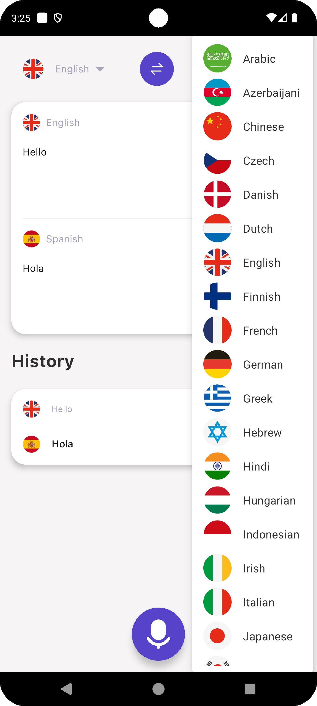
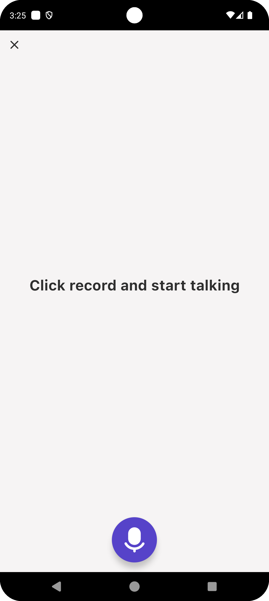

## Translator App

Translate text or record audio into many languages.

## Technologies Used

- KMP (Kotlin Multiplatform)
- Jetpack Compose
- SwiftUI
- Clean Code  
- SQLite
- Ktor
- Dependency Injection  

## Screenshots
<p align="center">
  
  
</p>

## Installation
  - Install [KDoctor](https://github.com/Kotlin/kdoctor) and follow the environment setup.
  - Install JDK 17 and configure Android Studio's JDK with this version.
  - To run the iOS app, you need to add your Apple ID to Xcode with an Apple Developer account to certify the application.
  - **Note:** The API used in this app is **private**, you need to create `NetworkConstants` in the `shared` -> `commonMain` -> `NetworkConstants` to successfully build the project.
```kotlin
object NetworkConstants {
    const val BASE_URL = "https://url-api"
}
```
